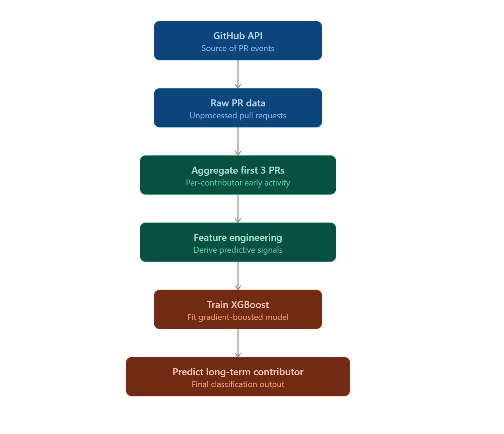

# GitHub Long-Term Contributor Predictor

Predicting, from a contributor's earliest pull requests, whether they'll go on to become a **long-term contributor** to the `pandas` repository.

## Motivation

Open-source maintainers rarely know, early on, which new contributors are worth investing mentorship time in. This project asks: **can we predict long-term engagement from just a contributor's first few PRs** — before their trajectory is obvious? A model like this could help maintainers prioritize onboarding/mentoring effort, or serve as a case study in early-signal prediction problems (structurally similar to customer churn prediction).

This project was developed to practice the complete machine learning lifecycle, from data collection and label construction through model development, evaluation, explainability, and deployment.

## Dataset

- **Source:** PR-level data pulled from the GitHub API for the `pandas` repository.
- **Unit of analysis:** one row per **contributor** (not per PR) — PR-level records were aggregated per user.
- **Final size:** 366 eligible contributors.
- **Class balance:** ~64% positive (long-term) / ~36% negative — mild imbalance.

### Label Definition

A contributor is labeled based on activity **after a freeze point**:

1. **Freeze at N=3 PRs.** Only a contributor's first 3 PRs are used to build features — nothing after PR #3 is visible to the model.
2. **Activity window (180 days).** Starting right after PR #3, we check whether the contributor opened any further PRs within a 180-day window. If yes → label `1` (long-term); if no → label `0`.
3. **"Activity" definition.** Any PR opened in the window counts (merged or not) — rejected-but-persistent contributors are treated as engaged, not as equivalent to no activity.
4. **Right-censoring.** Contributors whose 180-day window extended past the data collection cutoff (i.e., we couldn't fully observe their outcome) were dropped, since the volume affected was small.

`N` itself was chosen as a validation decision, not an arbitrary constant — candidates `[2, 3, 4, 5, 10]` were compared via validation F1. `N=10` was excluded despite a promising score because its eligible population was too small (<100 minority-class examples) to trust the result — a case of small-sample metric instability, not a real effect.

### Feature Engineering

Starting from ~105 raw PR-level columns, features were deliberately engineered (not dumped in raw) and aggregated per contributor using only information available **at or before PR #N** — nothing from the outcome window, to avoid leaking the label into the features:

| Feature | Description |
|---|---|
| `frac_merged` | Fraction of the contributor's first N PRs that were merged |
| `avg_days_between_prs` | Average gap between consecutive PRs (log-transformed to correct right-skew from outlier gaps) |
| `days_to_reach_Nth_pr` | Total days elapsed from PR #1 to PR #N |
| `author_association` | GitHub's association label (MEMBER / CONTRIBUTOR / NONE) as of PR #N — a per-PR snapshot field, not a lifetime status, confirmed safe to use since it reflects only information available at that point in time |

A `n_obs_prs` (count of observed PRs) feature was dropped after EDA revealed it was constant by construction (always equal to N within a single-N run) and therefore carried zero signal.

## Methodology

- **Splits:** 80% train / 10% validation / 10% test, stratified by label.
- **Model/feature/hyperparameter selection** was done using **train + validation only** — the test set was touched exactly once, at the very end, after all decisions (N, features, model, hyperparameters) were finalized.
- Once decisions were locked in, train and validation were **combined** for final model training, and test was evaluated a single time to produce the reported metrics.
- **Metric:** F1-score (not accuracy) was used throughout, given the class imbalance — a majority-class baseline would score deceptively well on accuracy alone.

### Models compared

Three models were evaluated with 5-fold cross-validation and `GridSearchCV` hyperparameter tuning:

| Model | CV Mean F1 |
|---|---|
| Logistic Regression | 0.744  |
| Random Forest | 0.712 |
| XGBoost | 0.790 (tuned: 0.772) |

**XGBoost** was selected as the final model.

### Handling class imbalance

The 64/36 imbalance was addressed by testing XGBoost's `scale_pos_weight` parameter. This improved class-0 (minority class) recall, but at the cost of a meaningful drop in class-1 recall and overall F1 — a direct precision/recall tradeoff, not a free improvement. Since the project's priority is identifying as many future long-term contributors as possible, **the unweighted model was kept as final**, prioritizing higher recall and F1 for the positive class over rebalanced (but weaker overall) performance.

## Results

Final model: tuned XGBoost, unweighted, evaluated once on the held-out test set (n=37):

| Class | Precision | Recall | F1-score | Support |
|---|---|---|---|---|
| 0 (won't stick around) | 0.67 | 0.29 | 0.40 | 14 |
| 1 (will stick around) | 0.68 | 0.91 | 0.78 | 23 |
| **Accuracy** | | | **0.68** | 37 |

**Interpretation:** the model is strong at catching genuine long-term contributors (91% recall on class 1) but weak at flagging contributors likely to disengage (29% recall on class 0) — a direct consequence of the class imbalance and the choice to prioritize recall/F1 on the majority class. This makes the model currently better suited to "who's worth mentoring early" than to "who's at risk of leaving."

## Explainability

SHAP was used to interpret the final model's predictions. `author_association` was the strongest predictor overall — contributors already marked `MEMBER` by their 3rd PR showed a near-perfect (20/20) association with the long-term label in EDA, which SHAP confirmed as the dominant signal.

## Limitations

- **Small dataset (366 rows, 37-row test set).** Reported metrics carry real statistical uncertainty; results should be read as directional, not precise.
- **Single-repo scope.** Trained and validated only on `pandas` contributors. Generalization to other repositories (different size, community norms, contribution volume) is untested.
- **No text features.** `pr_title` / `pr_body` were not used in this version, despite being available.
- **N selection predates final preprocessing.** `N=3` was chosen via validation before the skew-correction and constant-column-drop fixes were applied. The constant column removal couldn't have changed the outcome (equal-affect on all N); the log transform's effect on the N decision wasn't re-validated.
- **Class-0 recall (0.29) is a known, unresolved weakness**, discussed above — not hidden in a single aggregate metric.

## Leakage Prevention
All features were computed exclusively from pull requests observed up to PR #N. No information from the prediction window was used during feature engineering. The outcome label was constructed only after the feature freeze point, ensuring the model never observed future activity during training.

## Future Improvements

- **Deployment** — package the model behind an API/script so it can score a new contributor's early PR history in real time.
- Extend to **multiple repositories** to test generalization beyond `pandas`.
- Add **text-derived features** from `pr_title`/`pr_body` (length, code-block presence) as additional signal.
- Explore **threshold tuning** (adjusting the default 0.5 decision threshold) as an alternative to `scale_pos_weight` for balancing precision/recall without retraining.
- Re-validate the choice of `N` using the fully preprocessed feature set for full methodological rigor.
- Investigate additional features from the ~100 unused raw columns (e.g., repo-level metadata) using the same leakage-checked aggregation process established here.